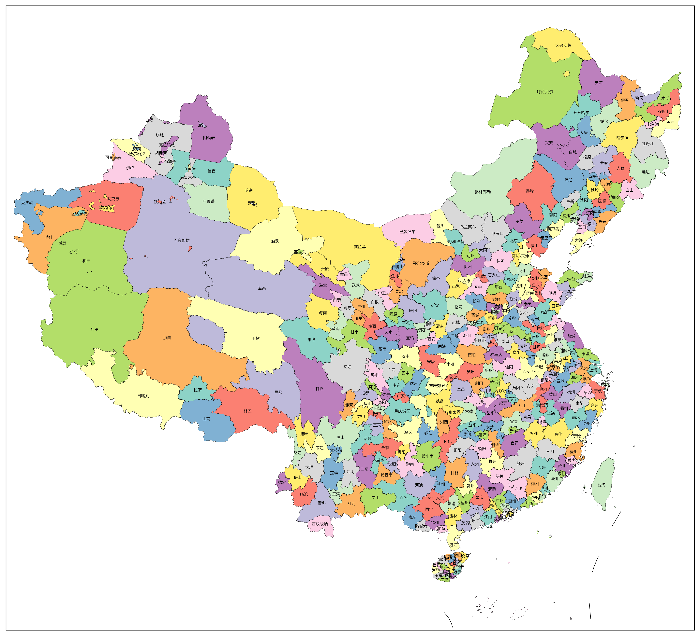

# amap-shp

## 简介

从 [高德地图行政区域查询接口](https://lbs.amap.com/api/webservice/guide/api/district) 下载县级行政区划数据，再合成市级、省级和国界的 GeoJSON，最后打包成 ZIP。

从 [DataV.GeoAtlas](https://datav.aliyun.com/portal/school/atlas/area_selector) 下载九段线数据并保存 GeoJSON。

坐标已从 GCJ-02 处理成了 WGS84。

## 用法

注册高德开放平台账号并申请密钥（key），将 key 填入 `.env` 配置文件。

在项目根目录下运行：

```bash
uv sync      # 同步依赖
uv run main  # 运行主程序
```

结果会输出到项目根目录下的 `output` 目录。

## 内容

`cn_border.geojson`

| country_name | country_adcode | geometry |
|--------------|----------------|----------|
| 中华人民共和国 | 100000 | MultiPolygon |

`cn_province.geojson`

| province_name | province_adcode | geometry |
|---------------|-----------------|----------|
| 北京市 | 110000 | Polygon |
| 天津市 | 120000 | MultiPolygon |
| 河北省 | 130000 | MultiPolygon |
| 山西省 | 140000 | Polygon |
| 内蒙古自治区 | 150000 | Polygon |

`cn_city.geojson`

| province_name | province_adcode | city_name | city_adcode | geometry |
|---------------|-----------------|-----------|-------------|----------|
| 北京市 | 110000 | 北京市 | 110000 | Polygon |
| 天津市 | 120000 | 天津市 | 120000 | MultiPolygon |
| 河北省 | 130000 | 石家庄市 | 130100 | Polygon |
| 河北省 | 130000 | 唐山市 | 130200 | MultiPolygon |
| 河北省 | 130000 | 秦皇岛市 | 130300 | MultiPolygon |

`cn_district.geojson`

| province_name | province_adcode | city_name | city_adcode | district_name | district_adcode | geometry |
|---------------|-----------------|-----------|-------------|---------------|-----------------|----------|
| 北京市 | 110000 | 北京市 | 110000 | 东城区 | 110101 | Polygon |
| 北京市 | 110000 | 北京市 | 110000 | 西城区 | 110102 | Polygon |
| 北京市 | 110000 | 北京市 | 110000 | 朝阳区 | 110105 | MultiPolygon |
| 北京市 | 110000 | 北京市 | 110000 | 丰台区 | 110106 | Polygon |
| 北京市 | 110000 | 北京市 | 110000 | 石景山区 | 110107 | Polygon |

`nine_line.geojson`

| name | geometry |
|------|----------|
| 九段线 | MultiPolygon |

## 注意

高德地图接口的数据随时可能更新，也不一定能保证边界严丝合缝，如果有错需要手动排查。

## 图例

由 [frykit](https://github.com/ZhaJiMan/frykit) 制作：





