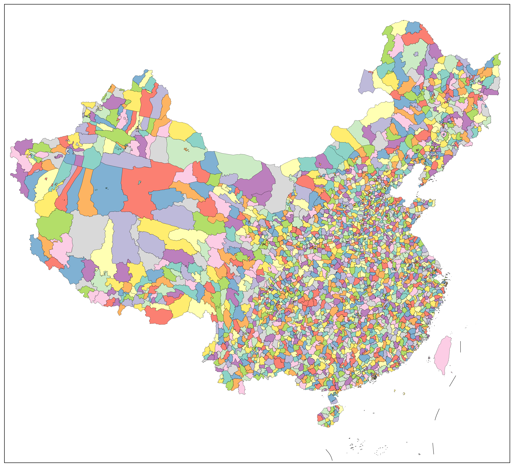

# amap-shp

## 简介

从 [高德地图行政区域查询接口](https://lbs.amap.com/api/webservice/guide/api/district) 下载县级行政区划数据，再合并导出市级、省级和国界的 GeoJSON，最后打包进 ZIP 压缩包。

从 [DataV.GeoAtlas](https://datav.aliyun.com/portal/school/atlas/area_selector) 下载九段线数据并生成 GeoJSON。

坐标已从 GCJ-02 坐标系处理到了 WGS84 坐标系上。

## 用法

- 注册高德开放平台账号并申请密钥（key），将 key 填入 `.env` 配置文件。
- 命令行 `uv.sync` 同步项目依赖
- 命令行 `uv run main` 运行主程序

## 图例

由 [frykit](https://github.com/ZhaJiMan/frykit) 制作：

